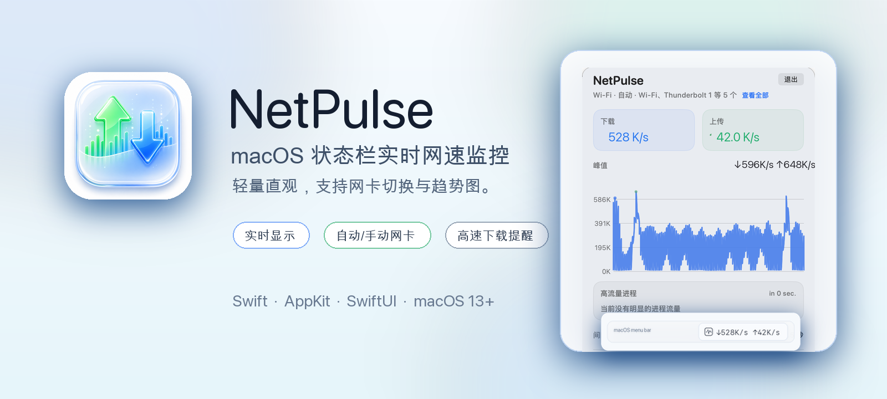
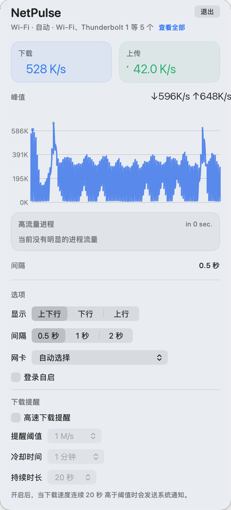

# NetPulse

NetPulse 是一个轻量的 macOS 状态栏网速监控应用。

它会在状态栏实时显示下载/上传速度，并提供一个详细面板，展示当前网络状态、历史趋势图、高流量进程，以及可选的高速下载提醒。

## 品牌素材

项目 Logo：


## 截图

菜单栏状态：


详细面板：



## 功能特性

- 在 macOS 状态栏实时显示网速
- 支持仅显示下载、仅显示上传、或同时显示上下行
- 支持自动选择网卡或手动锁定指定网卡
- 提供详细面板，展示当前速度、连接摘要和历史曲线
- 在面板打开时展示当前高流量进程
- 支持下载速度持续超过阈值时发送系统通知
- 支持打包后的 `.app` 开机自启
- 内置自定义 app 图标和品牌化状态栏图标

## 运行要求

- macOS 13 及以上
- Swift 6.3 及以上

## 权限说明

- 通知权限：
  当你启用“高速下载提醒”后，NetPulse 会在下载速度持续超过阈值一段时间后发送系统通知。
- 登录项权限：
  “登录自启”需要在打包后的 `.app` 中使用，某些情况下还需要在 `系统设置 > 通用 > 登录项` 中批准。

NetPulse 不依赖外部服务器、云账号或 API Key。

## 开发运行

直接从源码运行：

```bash
swift run
```

运行测试：

```bash
swift test
```

## 安装方式

### 方式一：从源码打包安装

```bash
git clone https://github.com/WesleyXuZzz/NetPulse.git
cd NetPulse
./scripts/build-app.sh
```

打包完成后，将 `dist/NetPulse.app` 移动到 `/Applications` 或 `~/Applications`。

`./scripts/build-app.sh` 默认使用 release 构建，并会重新生成 `dist/NetPulse.app`；如果该路径下已有旧的本地打包产物，会被新的应用包覆盖。

### 方式二：直接运行源码

```bash
swift run
```

这种方式适合开发和调试，但部分系统集成功能会受限，例如“登录自启”更适合在打包后的 `.app` 中使用。

## 打包应用

构建 macOS `.app`：

```bash
./scripts/build-app.sh
```

应用图标源文件：

```bash
Resources/AppIcon.png
```

打包后的应用输出位置：

```bash
dist/NetPulse.app
```

你可以将 `NetPulse.app` 移动到 `/Applications` 或 `~/Applications` 后再使用。

如果你准备把项目发布到 GitHub，请通过 Git 跟踪源码文件，不要手动上传本地构建产物。仓库中的 `.gitignore` 已排除 `.build/` 和 `dist/`。

## 项目结构

- `Sources/NetPulse`：主应用源码
- `Resources/AppIcon.png`：打包时使用的图标源图
- `scripts/build-app.sh`：macOS `.app` 打包脚本，默认使用 release 构建
- `scripts/generate_app_icon.swift`：图标生成脚本
- `Tests/NetPulseTests`：测试代码
- `docs/`：README 使用的 logo、banner 和截图素材

## 常见问题

### 为什么在线状态栏宽度保持不变？

NetPulse 的在线网速显示使用固定宽度槽位和等宽数字，下载/上传速度变化时不会频繁挤动菜单栏。离线或睡眠状态会折叠为更短的状态文字，以减少空白占用。

### 为什么“登录自启”不可用？

如果你是通过 `swift run` 直接运行源码，macOS 不会把它当成正式的 `.app` 安装包来处理。请先执行 `./scripts/build-app.sh`，再从打包后的 `NetPulse.app` 中开启“登录自启”。

### 为什么没有收到高速下载提醒？

请确认以下几点：

- 已打开“高速下载提醒”开关
- 已授予通知权限
- 当前下载速度连续超过你设置的阈值
- 持续时间达到了你设置的提醒时长

### 为什么看起来没有数据或显示离线？

NetPulse 会自动选择可用网卡。如果当前没有可用网络路径，或者你手动锁定的网卡暂时不可用，就可能显示离线。你可以在面板里的“网卡”选项切回“自动选择”再观察。

## 许可证

本项目基于 MIT License 开源，详见 [LICENSE](LICENSE)。
